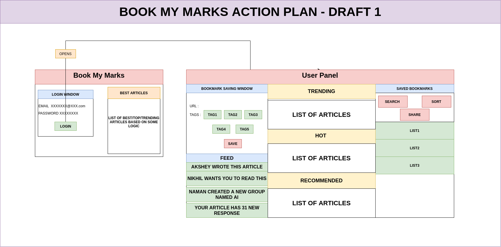

# Book My Marks

## This App is being designed to store bookmarks and democratize the use of resources on internet. This is intended to create a clutter free environment where you are not charged for anything. You are happy to create, share and debate over what should be shared with you. 

### App intend to go through following procedures

- [X] Creation of App Layout
- [X] Viewing List in the App
- [X] Elegant UI for Opening Screen.
- [X] Adding Link Opening in the Browser with Gesture Detection.
- [X] Adding App Icon
- [ ] Elegant UI for the BookMark List..
- [ ] Connection to Firebase to see all the bookmarks
- [ ] Distribution Among App
- [ ] Collective Distribution
  
### System Code is intended to go through following procedures

- [X] Create a basic UI for the System App.
- [X] Testing Connections and Data Transfer Over Firebase
- [X] Adding the Scripting Mode to AWS.
- [X] Distributed Layout Among The Computers
- [ ] Collective Distribution

